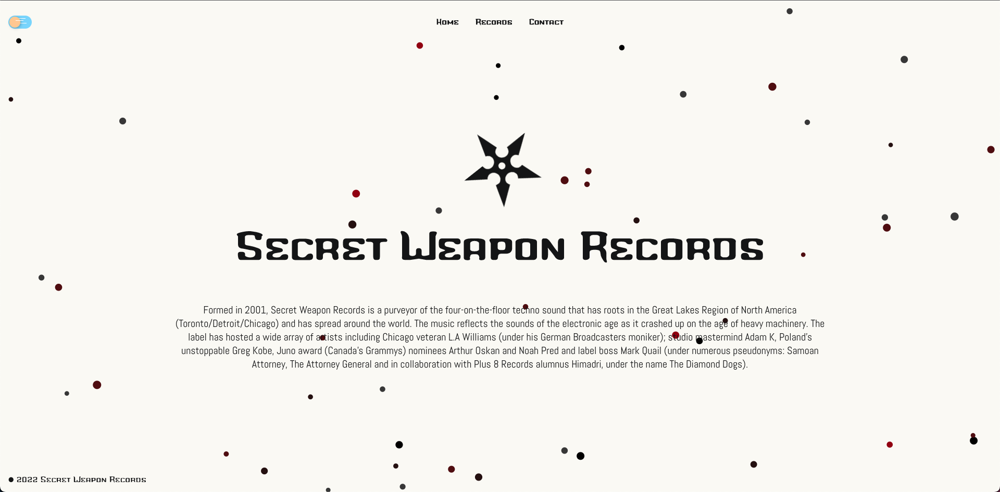
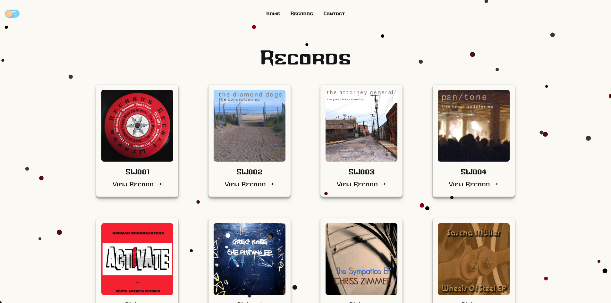
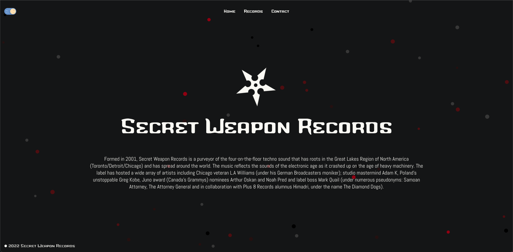

# Secret Weapon Records

A website built to pay homage to all the wonderful records released over the years by Secret Weapon Records. Secret Weapon Records is a purveyor of the four-on-the-floor techno sound that has roots in the Great Lakes Region of North America (Toronto/Detroit/Chicago) and has spread around the world.

## Screenshot of Secret Weapon Records website

## Screenshot of Records

## Screenshot of Homepage (Dark mode)

## Dependencies

This project uses the following systems:

- [React](https://github.com/facebook/react)
- [React Router](https://reactrouter.com/docs/en/v6)
- [PostgreSQL](https://www.postgresql.org/)
- [Express](https://expressjs.com/)

## Dev dependencies

- [Prettier](https://prettier.io/)

## Prerequisites

- [Node](https://nodejs.org/)
- [Docker](https://docs.docker.com/get-docker/)

## Local development

1. Run `docker-compose up --build`

## Deployed applications
